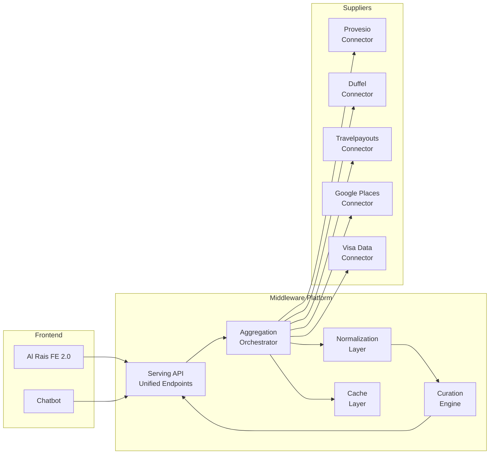
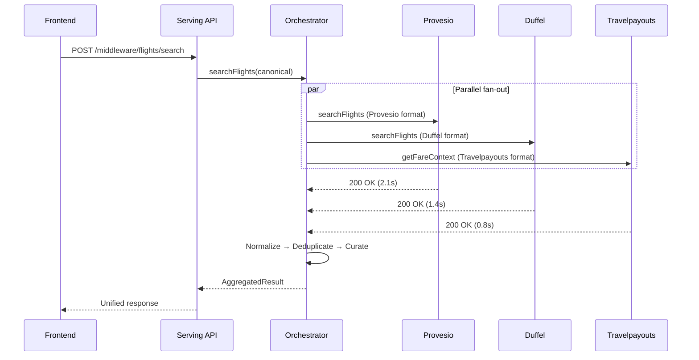
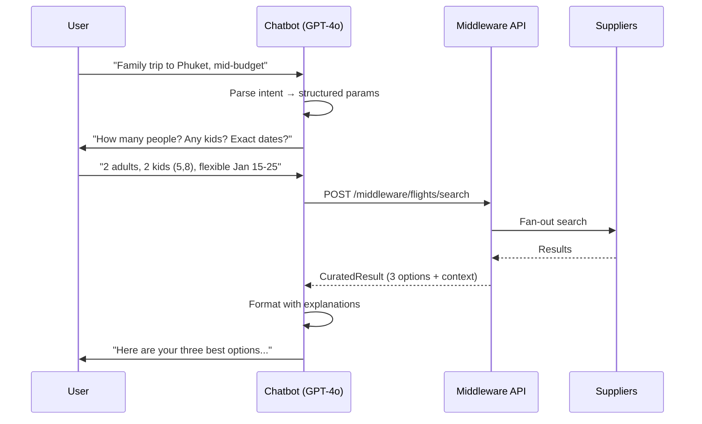
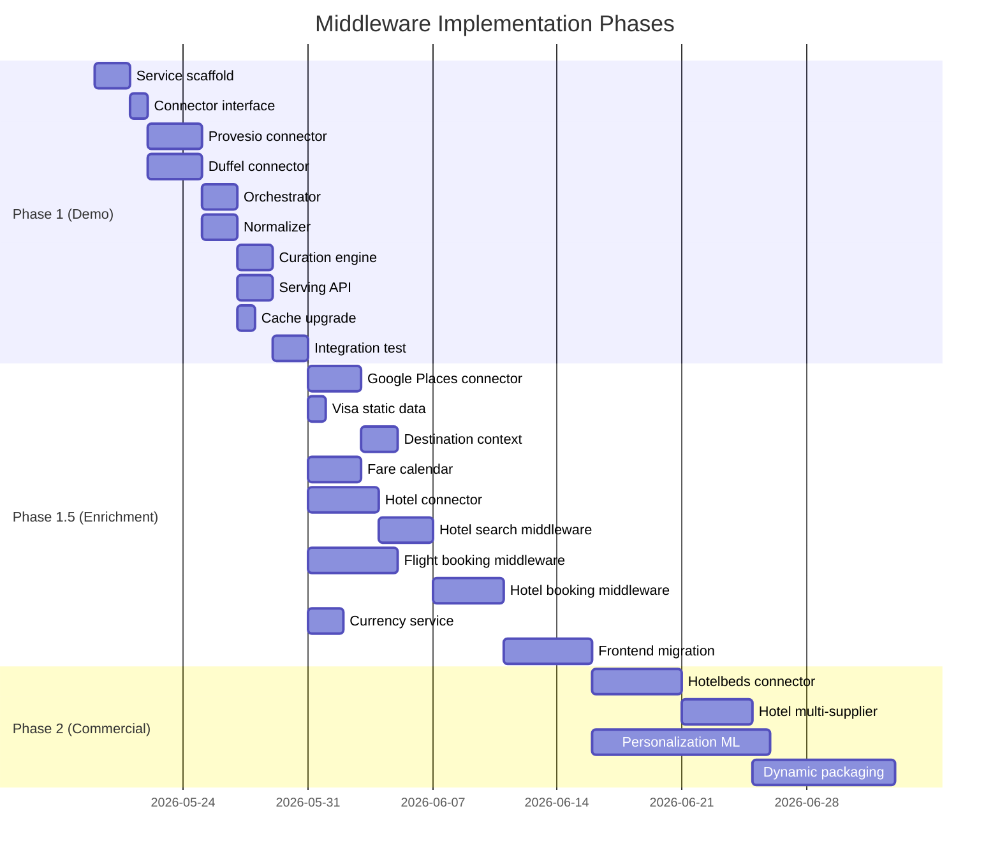

# Al Rais Holidays — Middleware Platform PRD v1

**Version:** 1.0
**Date:** 2026-05-19
**Author:** Technical Architecture Review
**Classification:** Internal — CIO / Engineering
**Status:** DRAFT — Pending stakeholder review

---

## Table of Contents

0. [Section 0 — Aggregator Type and Product Posture](#section-0--aggregator-type-and-product-posture)
1. [Section 1 — Foundation Analysis (Codebase Reconnaissance)](#section-1--foundation-analysis)
2. [Section 2 — Supplier API Landscape](#section-2--supplier-api-landscape)
3. [Section 3 — Middleware Architecture](#section-3--middleware-architecture)
4. [Section 4 — Data Models and Contracts](#section-4--data-models-and-contracts)
5. [Section 5 — Integration Patterns](#section-5--integration-patterns)
6. [Section 6 — Implementation Roadmap](#section-6--implementation-roadmap)
   - [6.0 Team Conversation Required Before Implementation](#60-team-conversation-required-before-implementation)
   - [6.1 Phase 1 — Demo Scope](#61-phase-1--demo-scope-may-21-target)
   - [6.1.1 Team Role Instructions — Commit-Level Detail](#611-team-role-instructions--commit-level-detail)
7. [Section 7 — Risk Assessment and Mitigations](#section-7--risk-assessment-and-mitigations)

**Appendices:**
- [A — File Reference Index](#appendix-a--file-reference-index)
- [B — Glossary](#appendix-b--glossary)
- [C — Open Questions for Stakeholder Review](#appendix-c--open-questions-for-stakeholder-review)
- [D — Curation Rules Catalog (Phase 1)](#appendix-d--curation-rules-catalog-phase-1)

---

## Section 0 — Aggregator Type and Product Posture

**This middleware is a CURATING AGGREGATOR.** This is a deliberate product choice, not an architectural default.

There are three aggregator types in the travel industry:

1. **Pass-through aggregator** — calls supplier APIs, displays whatever they return, lets the user compare. Skyscanner, Kayak. Value is reach.

2. **Normalizing aggregator** — calls multiple suppliers, transforms responses into a unified shape, displays a consistent list. Value is consistent UX.

3. **Curating aggregator** — normalizes AND applies judgment. Receives N results, returns 3 with explanations and tradeoffs. Value is intelligence.

This middleware is type 3. **This choice is not negotiable in scope.** It is the product reason Al Rais's platform exists as differentiated from Wego, Almosafer, or dnata Travel.

### Implications

- The orchestrator **MUST** fan out to multiple suppliers; single-supplier operation is degraded mode, not steady state.
- The normalization layer **MUST** output a unified shape; supplier-shaped pass-through is not acceptable.
- The curation engine **MUST** produce three options with explanations; returning a sorted list of N results is not the product.
- The serving API **MUST** return curated output as the primary response; the full sorted list is supplementary, not primary.

### Scope Protection Rule

If at any point during implementation it appears curation is not achievable in the Phase 1 timeline, the correct response is to:

**(a)** Reduce supplier count (single supplier with curation is acceptable)
**(b)** Simplify curation rules (rule-based with three explanations is the floor, not the ceiling)

The correct response is **NOT** to fall back to normalizing or pass-through aggregator. Those are different products.

---

## Section 1 — Foundation Analysis

### 1.1 Provesio Integration Pattern Summary

As documented in `flight_search_architecture.md` Section 4 and `hotel_search_architecture.md` Section 4, the current Provesio integration follows a consistent pattern across both flight and hotel services:

**Authentication:** A shared credential set (`USERNAME`, `PASSWORD`, `COMPANY_CODE`) stored in SSM Parameter Store under `/provesio/*` is used to call `POST /auth/login`, which returns a `sessionId`. This sessionId is cached in Redis with a TTL of 30–300 seconds (clamped from the supplier's `price_valid_until` field). Every subsequent API call includes three custom headers: `X-API-KEY`, `sessionId`, and `conversationId`.

**Session architecture:** The sessionId is a **shared singleton** — all concurrent users share one Provesio session cached in Redis. The conversationId is per-user, stored in Redis at `conversationId:{userId}` (flights) or `conversationId:hotel:{userId}` (hotels) with a 1500-second TTL. This design means the middleware inherits a coupling between user identity and Provesio conversation state that must be preserved or explicitly replaced.

**Async fetch pattern:** For long-running operations (search, provisional booking), Provesio returns `{ asyncFetch: { fetchUrl: "/some/path" } }`. The handler polls `{MAIN_ENDPOINT}{fetchUrl}` synchronously until `meta.success === true && data.length > 0`. As noted in `flight_search_architecture.md` Risk #10, this blocks Lambda invocations without backoff. The middleware must own this polling lifecycle.

**Two distinct base URLs:** `BASE_URL` for standard API calls and `MAIN_ENDPOINT` for async fetch URLs. These are different hosts, stored in separate SSM parameters. The middleware must manage both.

### 1.2 Existing Capability Mapping to Middleware Components

The middleware spec (RTF) defines six components. Here is how the existing codebase maps:

| Middleware Component | Existing Coverage | Extraction Difficulty |
|---|---|---|
| **Supplier Connectors** | Provesio only. 7 flight endpoints + 9 hotel endpoints hardcoded in handler files. No connector abstraction. | HIGH — endpoints, headers, payload shapes, and response parsing are interwoven with business logic in each handler. |
| **Aggregation Orchestrator** | Does not exist. Each handler calls exactly one supplier synchronously. No fan-out, no timeout-based partial results. | NEW BUILD — no existing code to extract. |
| **Normalization Layer** | Partial. `flightSearch.js:256-288` enriches Provesio responses with airline logos and names. Hotel handlers return Provesio shapes unchanged. No unified flight/hotel object exists. | MEDIUM — enrichment logic is extractable, but no canonical schema exists. |
| **Curation Engine** | Does not exist. No ranking, scoring, deduplication, or explanation generation. Frontend receives raw supplier results. | NEW BUILD. |
| **Caching Layer** | Exists. Redis (ElastiCache, cache.t3.micro, Redis 7.0) with SHA256-based cache keys. Separate TTL strategies for search (30–300s), sessions (30–300s), fare rules (900s), airlines (3600s). See `flight_search_architecture.md` Section 3 for key patterns. | LOW — cache infrastructure is reusable. Key naming and TTL logic need abstraction for multi-supplier keys. |
| **Serving API** | Does not exist as a unified layer. Each handler is its own API endpoint. Frontend calls 13+ flight endpoints and 12+ hotel endpoints directly. | MEDIUM — new unified API surface needed, but existing endpoint contracts define the backward-compatible interface. |

### 1.3 What Can Stay

1. **Redis infrastructure.** The existing ElastiCache cluster, ioredis singleton pattern (`lib/redisClient.js`), and SHA256 cache key generation (`lib/cacheKey.js`) are sound. The middleware should reuse the same Redis instance, adding a key namespace prefix per supplier (e.g., `provesio:flightSearch:{hash}`, `duffel:flightSearch:{hash}`).

2. **SSM credential management.** The pattern of storing supplier credentials in SSM Parameter Store under a supplier namespace (`/provesio/*`) is correct and should be extended for new suppliers (`/duffel/*`, `/hotelbeds/*`).

3. **SQS async workflow pattern.** The 7 SQS queues in flight-search (with DLQs) for booking persistence, email, high-demand tracking, and people-viewing are architecturally sound. The middleware does not need to replace these — they remain downstream of the booking flow.

4. **DynamoDB booking persistence.** Tables `prov-booking-{stage}`, `flight-booking-{stage}`, `hotel-pre-book-{stage}`, `hotel-book-{stage}` store booking state correctly. The middleware's normalization layer should write to these tables using supplier-agnostic booking reference IDs.

5. **Auth layer.** The `authorizerLayer` Lambda Layer (JWT verification via Cognito) is reusable. The middleware API can use the same layer.

### 1.4 What Must Be Abstracted

1. **Supplier authentication.** `helper.js:getSessionId()` in both flight-search and hotel-search hardcodes Provesio's login URL, payload shape (`{ userName, password, companyCode }`), and response path (`response.data.data[0].sessionId`). Each supplier has a different auth model:
   - Provesio: session-based login → sessionId header
   - Duffel: Bearer token (API key), no session
   - Hotelbeds: API key + HMAC-SHA256 signature per request
   - Amadeus: OAuth2 client credentials flow

   The middleware needs a `SupplierAuth` interface with per-supplier implementations.

2. **Request transformation.** Each handler constructs Provesio-specific request payloads. For example, `flightSearch.js:165-179` builds `{ flightSegments, passengers, preference, formOfPayment: "CR", travelType: "P" }`. Duffel expects `{ slices: [{ origin, destination, departure_date }], passengers: [{ type }] }`. The middleware needs a canonical search request that each supplier connector transforms.

3. **Response normalization.** Provesio returns `data.data[0].journey[].flightSegments[]` with fields like `marketingAirline`, `departureAirportCode`. Duffel returns `data.offers[].slices[].segments[]` with `marketing_carrier.iata_code`, `origin.iata_code`. These must map to a unified flight object.

4. **Error handling.** `helper.js:InternalError()` (present in both services) returns raw Provesio error details to the client, including internal status codes and data structures. The middleware must normalize errors into a supplier-agnostic format and prevent information leakage.

5. **Endpoint routing.** The frontend currently makes direct calls to 25+ individual endpoints across two API Gateways. The middleware must expose a single API surface, routing internally to the correct supplier(s).

### 1.5 What Must Be Refactored

1. **Synchronous async-fetch polling.** As documented in `flight_search_architecture.md` Risk #10, `flightProvBooking.js:141-174` polls Provesio synchronously with no backoff, blocking the Lambda. The middleware should implement SQS-based polling with exponential backoff, returning a `202 Accepted` with a status-check URL.

2. **Full-table DynamoDB scans.** `myBooking.js:71-85` (flights) and `getAllBooking.js` (no auth) perform unbounded `Scan` operations. The middleware's booking retrieval must use `Query` with userId as partition key.

3. **Non-atomic double writes.** `hotelBooking.js:326-364` writes to `hotel-book` then updates `hotel-pre-book` without DynamoDB TransactWriteItems. The middleware must use transactions for any multi-table booking writes.

4. **Hardcoded table names.** Multiple handlers reference `logtrace-dev`, `users-dev`, `countries-listing-dev` instead of `${stage}` variables (see `flight_search_architecture.md` Risk #5, `hotel_search_architecture.md` Risk #6). These must be parameterized before the middleware can operate in production.

5. **CORS violation.** All handlers use `origin: '*'` with `allowCredentials: true`, which violates the CORS specification and causes browser preflight failures. The middleware API must specify explicit allowed origins.

### 1.6 Hidden Coupling Not Surfaced in Original Audits

1. **Frontend baseURL routing.** The frontend `axiosClient` (in `src/services/axios.ts`) uses a request interceptor that routes to different API Gateway URLs based on the request path. There are 11 `VITE_*_API_BASE` environment variables pointing to different API Gateways. Introducing a middleware means either:
   - (a) A single middleware URL replaces all 11 (breaking change, requires frontend update), or
   - (b) The middleware sits behind the existing API Gateways as a Lambda layer (preserves URLs but adds latency).
   Option (a) is recommended.

2. **ConversationId cross-handler dependency.** The `conversationId` created during `flightSearch` is stored in Redis and retrieved during `flightProvBooking` and `reservationFlightBooking` by looking up the original search's `logtrace` record. This creates a hidden dependency chain: search → fare rules → prov-booking → final booking all share a conversationId that ties them to a single Provesio session. If the middleware introduces alternative suppliers, each supplier flow needs its own session continuity mechanism.

3. **Log-trace step codes.** The `logtrace` table uses `stepCode` values (10=search, 30=fare-rules, 40=prov-booking, 50=booking, 140=ticket-upload) that are Provesio-flow-specific. Multi-supplier flows need a generalized step taxonomy.

4. **Guest-to-Cognito user handoff.** When a guest user browses and a Cognito user books, `getConversationIdFromRedis` (`helper.js:222`) looks up the original guest's `logtrace` to find the conversationId. This coupling means the middleware must maintain the `logtrace` write pattern for Provesio flows, even if new suppliers don't need it.

5. **Airline logos from hardcoded S3 map.** `helper/airlineLogos.js` maps IATA codes to S3-hosted logo URLs. This enrichment happens in the handler, not in a shared service. The middleware's normalization layer must own airline metadata enrichment, and the logo map must be externalized (database or CDN).

6. **"People viewing" is fabricated.** `flightSearch.js:302` returns `Math.floor(Math.random() * 5) + 1` as the "people viewing" count, while real tracking data is written to DynamoDB by the `peopleViewingFlights` SQS worker but never read. The middleware should either surface real data or remove the feature.

---

## Section 2 — Supplier API Landscape

### 2.1 Current State: Single-Supplier Dependency

As documented in `REPO_AUDIT.md` Section 8 and `SOW-AUDIT-REPORT.md`, the platform currently depends on a single aggregator (Provesio) for all flight and hotel inventory. Of the 36 API integrations listed in the SOW, only Provesio has real code. PayFort (sandbox), Tamara (via PayFort), and AWS SES are the only other connected external services.

### 2.2 Supplier Evaluation Matrix

The middleware spec defines a phased supplier strategy. Here is the evaluation of each supplier against project requirements:

#### 2.2.1 Duffel (Phase 1 — Demo)

**Purpose:** Alternative flight source to demonstrate multi-supplier aggregation.
**Coverage:** 300+ airlines via GDS (Sabre, Travelport) and NDC connections.
**API Model:** REST, JSON, Bearer token auth. No session management needed.
**Pricing:** Pay-per-search model. Sandbox is free.
**Hotel support:** Yes — Duffel Stays API provides hotel search and booking across millions of properties worldwide.
**Key capabilities:**
- Offer search: `POST /air/offer_requests` with slices, passengers
- Offer details: `GET /air/offers/{id}`
- Order creation: `POST /air/orders` (booking)
- Order cancellation: `POST /air/order_cancellations`
- Seat maps, baggage, loyalty programs via ancillary endpoints

**Strengths for Al Rais:**
- Modern REST API with clear documentation at `duffel.com/docs`
- Node.js SDK available (`@duffel/api`)
- No session management complexity (stateless Bearer auth)
- Both flights AND hotels in one API — could replace Provesio entirely for content comparison

**Risks:**
- Pay-per-search cost model needs volume projections
- Sandbox inventory is synthetic — demo should set expectations accordingly

**Recommendation:** PRIMARY alternative supplier for Phase 1. Use sandbox for demo, evaluate production pricing post-demo.

#### 2.2.2 Amadeus Self-Service (Phase 1.5 — Calendar Fare Matrix)

**Purpose:** Calendar fare matrix data that Provesio lacks.

**CRITICAL FINDING: Amadeus is shutting down its Self-Service APIs portal. New registrations paused in March 2026. Full decommission scheduled for July 17, 2026.** API keys will be deactivated and portal access removed. Enterprise customers can migrate to Enterprise APIs, but that requires a commercial relationship with Amadeus.

**Impact on middleware plan:** The middleware spec lists "Amadeus self-service for calendar fare matrix data" as a Phase 1.5 component. This is no longer viable.

**Alternatives for calendar fare matrix:**
1. **Duffel** — supports date range searches natively
2. **Travelpayouts** — provides historical fare data and fare calendars via affiliate API
3. **Kiwi.com Tequila API** — flexible date search with fare calendars
4. **Custom computation** — cache Provesio search results across a date range (7-day window), build fare matrix from cached data

**Recommendation:** Drop Amadeus from the plan. Use Duffel's date-range search for flexible-date scenarios. Supplement with Travelpayouts fare calendar data for price context.

#### 2.2.3 Travelpayouts (Phase 1 — Price Context)

**Purpose:** Affiliate price comparison data for contextual pricing intelligence.
**API Model:** REST, JSON, API token auth. Requires registration in Travelpayouts affiliate network.
**Rate limits:** 100 requests/minute per marker, max 10 links per request.
**Key capabilities:**
- Cheapest tickets: historical and real-time fare data
- Flight price calendar: monthly/weekly fare grids
- Airline/airport reference data
- Hotel price comparison via partner brands

**Strengths:**
- Free to use (affiliate model — revenue share on bookings)
- Historical fare data enables "price vs. average" comparisons
- Airport and airline reference data supplements enrichment layer

**Limitations:**
- Not a booking API — display-only pricing data
- Data may lag real-time availability by hours
- Terms restrict using data to undercut affiliate partners

**Recommendation:** Use for price intelligence layer (fare calendars, "is this a good deal?" context). Do NOT use for bookable inventory.

#### 2.2.4 Hotelbeds (Phase 2 — Hotel Content Quality)

**Purpose:** Hotel content depth (descriptions, images, amenities) and alternative hotel inventory.
**API Model:** REST, JSON+XML. API key + HMAC-SHA256 signature authentication.
**Key APIs:**
- **Booking API:** Real-time hotel search, rate checking, booking, cancellation
- **Content API:** Hotel descriptions, images, facilities, points of interest
- **Cache API:** Pre-computed availability snapshots for high-traffic platforms

**Auth pattern:** Every request includes `Api-Key` header and `X-Signature` header computed as `SHA256(apiKey + secret + utcEpochSeconds)`.

**Existing Al Rais code:** `alrais-hotel-beds-availability` already integrates with Hotelbeds APITUDE, but only for **activities/sightseeing**, not hotels. The auth pattern (`helper.js:284-285`, which also logs credentials — see `REPO_AUDIT.md` Section 7.5) is reusable.

**Recommendation:** Phase 2 supplier. Extend existing Hotelbeds auth pattern to hotel Booking API. Content API is high-value for enriching Provesio's sparse hotel data.

#### 2.2.5 Google Places API (Phase 1.5 — Content Augmentation)

**Purpose:** Destination intelligence — photos, reviews, points of interest, walking distances.
**API Model:** REST, API key auth.
**Pricing:** Autocomplete sessions with Place Details are effectively free (up to 12 keystrokes per session). Place Details requests billed at $17/1000 (Essentials), $25/1000 (Pro), $30/1000 (Enterprise).
**Current usage:** Frontend already uses Nominatim/Photon for geocoding (free, public). No Google Places integration exists.

**Key capabilities for middleware:**
- Place Details: descriptions, ratings, reviews, photos, opening hours
- Place Photos: high-resolution destination images
- Nearby Search: attractions within radius of hotel/destination
- Autocomplete: airport/destination name completion (replace current IATA lookup)

**Cost optimization:**
- Use session tokens for Autocomplete → Place Details flows (keystrokes are free)
- Cache Place Details responses aggressively (data changes infrequently)
- Use Place Details (Basic) SKU where possible ($0 with Essentials)
- Estimated cost: ~$50-100/month at projected search volumes

**Recommendation:** Phase 1.5. High value for content differentiation. Implement with aggressive caching (24h TTL for place details, 7-day for photos).

#### 2.2.6 Visa Intelligence APIs (Phase 1.5 — Static Data Layer)

**Purpose:** Passport/visa requirement lookup for destination intelligence.

**Options evaluated:**

| Provider | Coverage | Update Frequency | Access Model | Cost |
|---|---|---|---|---|
| **IATA Timatic** | 220+ countries, 2000+ sources | 200 updates/day | IATA partnership or reseller | Enterprise pricing |
| **Sherpa** | Global, IATA-recognized | Real-time | REST API, subscription | Tiered pricing |
| **VisaList.io** | 199 countries | Daily | REST API | Free tier available |
| **VisaHQ** | 200+ countries | Real-time | Partner API | Revenue share |

**Recommendation for Phase 1.5:** Start with a **static data layer** — a JSON lookup table mapping `(passport_country, destination_country) → { visa_required, visa_type, processing_days, notes }` covering the top 50 UAE-origin destination pairs. This avoids API cost and latency for the demo. Upgrade to Sherpa or VisaList.io API for production.

**Static data structure:**
```json
{
  "AE→TH": { "visa_required": false, "stay_days": 30, "notes": "Visa-free entry for UAE passport holders" },
  "AE→GB": { "visa_required": true, "visa_type": "Standard Visitor", "processing_days": 15 },
  "AE→US": { "visa_required": true, "visa_type": "B1/B2", "processing_days": 30 }
}
```

#### 2.2.7 Travelfusion (Phase 2 — LCC Depth)

**Purpose:** Low-cost carrier depth for UAE-relevant airlines (Fly Dubai, Air Arabia, Wizz Air Abu Dhabi).
**Status:** Not yet evaluated in detail. Phase 2 integration.
**Note:** Many LCCs are increasingly available through Duffel's NDC connections, which may reduce the need for Travelfusion.

### 2.3 Supplier Priority Matrix

| Priority | Supplier | Phase | Value | Effort | Auth Model |
|---|---|---|---|---|---|
| 1 | **Provesio** | Existing | Production inventory | Refactor (extract) | Session-based login |
| 2 | **Duffel** | Phase 1 | Multi-source demo | Medium (new connector) | Bearer token |
| 3 | **Travelpayouts** | Phase 1 | Price intelligence | Low (read-only API) | API token |
| 4 | **Google Places** | Phase 1.5 | Content augmentation | Low (caching layer) | API key |
| 5 | **Visa static data** | Phase 1.5 | Destination intelligence | Trivial (JSON file) | N/A |
| 6 | **Hotelbeds** | Phase 2 | Hotel content quality | Medium (extend existing) | HMAC-SHA256 |
| 7 | ~~Amadeus~~ | ~~Phase 1.5~~ | ~~Calendar fares~~ | ~~N/A~~ | ~~SHUTDOWN JULY 2026~~ |

---

## Section 3 — Middleware Architecture

### 3.1 High-Level Architecture



### 3.2 Component Specifications

#### 3.2.1 Supplier Connectors

Each connector implements the `SupplierConnector` interface:

```typescript
interface SupplierConnector {
  readonly name: string;
  readonly capabilities: SupplierCapability[];

  // Lifecycle
  initialize(): Promise<void>;
  healthCheck(): Promise<HealthStatus>;

  // Auth
  authenticate(): Promise<AuthContext>;

  // Search
  searchFlights(request: CanonicalFlightSearch): Promise<SupplierFlightResult>;
  searchHotels?(request: CanonicalHotelSearch): Promise<SupplierHotelResult>;

  // Booking (only for bookable suppliers)
  createProvisionalBooking?(offer: NormalizedOffer): Promise<ProvisionalBooking>;
  confirmBooking?(provisional: ProvisionalBooking, passengers: Passenger[]): Promise<ConfirmedBooking>;
  cancelBooking?(bookingRef: string): Promise<CancellationResult>;

  // Content (read-only suppliers)
  getFareCalendar?(route: Route, dateRange: DateRange): Promise<FareCalendar>;
  getPlaceDetails?(placeId: string): Promise<PlaceDetails>;
  getVisaRequirements?(passport: string, destination: string): Promise<VisaInfo>;
}

type SupplierCapability =
  | 'flight_search' | 'flight_booking'
  | 'hotel_search' | 'hotel_booking'
  | 'fare_calendar' | 'content_augmentation'
  | 'visa_data' | 'price_intelligence';
```

**Provesio connector extraction plan:**

The Provesio connector wraps the existing Provesio API calls, extracting them from the current handler files:

| Existing File | Existing Function | Connector Method |
|---|---|---|
| `flight-search/helper/helper.js:getSessionId()` | Provesio login + Redis session cache | `authenticate()` |
| `flight-search/handlers/flightSearch.js:215-230` | POST `/flight/search` + async fetch | `searchFlights()` |
| `hotel-search/handlers/hotelSearch.js` | POST `/hotel/search` | `searchHotels()` |
| `flight-search/handlers/flightProvBooking.js:120` | POST `/reservation/flight-prov-book` | `createProvisionalBooking()` |
| `flight-search/handlers/reservationFlightBooking.js:230` | POST `/reservation/flight-book` | `confirmBooking()` |
| `flight-search/handlers/fareRuleSearch.js:98` | POST `/flight/fare-rule-search` | `getFareRules()` |
| `hotel-search/handlers/hotelPreBook.js` | POST `/reservation/hotel-pre-book` | `createProvisionalBooking()` |
| `hotel-search/handlers/hotelBooking.js` | POST `/reservation/hotel-book` | `confirmBooking()` |
| `hotel-search/handlers/hotelCancellation.js` | POST `/reservation/hotel-cancel` | `cancelBooking()` |

**Duffel connector (new build):**

```typescript
class DuffelConnector implements SupplierConnector {
  name = 'duffel';
  capabilities = ['flight_search', 'flight_booking', 'hotel_search', 'hotel_booking'];

  // Auth: Bearer token from SSM /duffel/api_key
  // No session management needed (stateless)

  // Search: POST /air/offer_requests → GET /air/offers
  // Booking: POST /air/orders
  // Cancel: POST /air/order_cancellations
}
```

#### 3.2.2 Aggregation Orchestrator

The orchestrator manages parallel fan-out to multiple suppliers with timeout-based partial results.

```typescript
interface AggregationConfig {
  suppliers: string[];                // e.g., ['provesio', 'duffel']
  timeout: number;                    // Global timeout in ms (default: 8000)
  minSuppliers: number;               // Minimum responses before returning (default: 1)
  failureStrategy: 'partial' | 'all'; // Return partial results or fail entirely
}

class AggregationOrchestrator {
  async searchFlights(
    request: CanonicalFlightSearch,
    config: AggregationConfig
  ): Promise<AggregatedResult> {
    // 1. Fan out to all configured suppliers in parallel
    // 2. Wait for min(timeout, all responses)
    // 3. Return partial results if timeout reached but minSuppliers responded
    // 4. Include metadata: which suppliers responded, latency per supplier, errors
  }
}
```

**Fan-out flow:**



**Timeout handling:**
- Phase 1 global timeout: 8 seconds
- If Provesio responds but Duffel doesn't: return Provesio results, mark Duffel as `timed_out`
- If neither responds in 8 seconds: return cached results (if available) with `stale: true` flag
- Travelpayouts is non-blocking — its data augments results but doesn't block response

**Error isolation:** Each supplier connector runs in its own `Promise.allSettled()` slot. A failure in one supplier never blocks others. Errors are captured and returned in `result.meta.supplierErrors`.

#### 3.2.3 Normalization Layer

The normalization layer transforms supplier-specific response shapes into canonical objects.

**Canonical Flight Object:**

```typescript
interface NormalizedFlightOffer {
  // Identity
  id: string;                          // Middleware-generated UUID
  supplier: string;                    // 'provesio' | 'duffel' | etc.
  supplierOfferId: string;            // Original supplier offer ID

  // Itinerary
  slices: NormalizedSlice[];           // Outbound, return (if round-trip)

  // Pricing
  price: {
    total: number;                     // In display currency
    currency: string;                  // ISO 4217
    supplierCurrency: string;          // Original supplier currency
    supplierTotal: number;             // Original amount before conversion
    breakdown: PriceBreakdown[];       // Per-passenger breakdown
    validUntil: string;                // ISO 8601
  };

  // Fare details
  fareFamily: string | null;           // 'Economy', 'Economy Flex', etc.
  cabinClass: string;                  // 'economy' | 'premium_economy' | 'business' | 'first'
  refundable: boolean;
  baggageIncluded: BaggageAllowance;

  // Metadata
  bookable: boolean;                   // Whether this supplier supports booking
  source: 'live' | 'cached';
  fetchedAt: string;                   // ISO 8601
}

interface NormalizedSlice {
  origin: Airport;
  destination: Airport;
  departureAt: string;                 // ISO 8601
  arrivalAt: string;                   // ISO 8601
  duration: number;                    // Minutes
  segments: NormalizedSegment[];
  stops: number;
}

interface NormalizedSegment {
  carrier: Airline;
  flightNumber: string;
  aircraft: string | null;
  origin: Airport;
  destination: Airport;
  departureAt: string;
  arrivalAt: string;
  duration: number;
  cabinClass: string;
  layoverMinutes: number | null;       // Time until next segment
}

interface Airport {
  iataCode: string;
  name: string;
  city: string;
  country: string;
}

interface Airline {
  iataCode: string;
  name: string;
  logoUrl: string;
}
```

**Provesio → Canonical mapping:**

| Provesio Field | Canonical Field | Transform |
|---|---|---|
| `offer.journey[].flightSegments[].marketingAirline` | `segment.carrier.iataCode` | Direct map |
| `offer.journey[].flightSegments[].departureAirportCode` | `segment.origin.iataCode` | Direct map |
| `offer.journey[].flightSegments[].departureDateTime` | `segment.departureAt` | Parse to ISO 8601 |
| `offer.journey[].flightSegments[].duration` | `segment.duration` | Parse duration string to minutes |
| `offer.offerId` | `supplierOfferId` | Direct map |
| (enriched) `marketingAirlineFullName` | `segment.carrier.name` | From airline-codes lookup |
| (enriched) `marketingAirlineLogo` | `segment.carrier.logoUrl` | From S3 logo map |
| `offer.fare.totalFare` | `price.total` | Convert to display currency |

**Duffel → Canonical mapping:**

| Duffel Field | Canonical Field | Transform |
|---|---|---|
| `offer.slices[].segments[].marketing_carrier.iata_code` | `segment.carrier.iataCode` | Direct map |
| `offer.slices[].segments[].origin.iata_code` | `segment.origin.iataCode` | Direct map |
| `offer.slices[].segments[].departing_at` | `segment.departureAt` | Already ISO 8601 |
| `offer.slices[].segments[].duration` | `segment.duration` | ISO 8601 duration → minutes |
| `offer.id` | `supplierOfferId` | Direct map |
| `offer.total_amount` | `price.total` | Parse decimal string |
| `offer.total_currency` | `price.currency` | Direct map |

**Canonical Hotel Object:**

```typescript
interface NormalizedHotelOffer {
  id: string;
  supplier: string;
  supplierHotelId: string;

  property: {
    name: string;
    starRating: number;
    address: string;
    city: string;
    country: string;
    latitude: number;
    longitude: number;
    images: string[];
    amenities: string[];
    description: string;
    checkIn: string;                   // Time, e.g., "14:00"
    checkOut: string;                  // Time, e.g., "12:00"
  };

  rooms: NormalizedRoom[];

  price: {
    total: number;
    perNight: number;
    currency: string;
    supplierCurrency: string;
    supplierTotal: number;
    validUntil: string;
  };

  cancellation: {
    freeCancellationUntil: string | null;
    policy: string;
  };

  mealPlan: string | null;            // 'room_only' | 'breakfast' | 'half_board' | 'full_board' | 'all_inclusive'
  bookable: boolean;
  source: 'live' | 'cached';
  fetchedAt: string;
}
```

**Deduplication logic:**

When multiple suppliers return the same flight (identified by `carrier + flightNumber + departureAt`), the deduplicator:
1. Groups offers by flight identity fingerprint
2. Within each group, selects the offer with lowest price
3. Preserves supplier attribution for the selected offer
4. Records the alternative supplier price in `offer.meta.alternativePrices[]`

#### 3.2.4 Curation Engine

The curation engine ranks normalized results and produces the three-option output described in the middleware spec.

```typescript
interface CurationConfig {
  userContext: {
    travelType: 'solo' | 'couple' | 'family' | 'business';
    budget: 'low' | 'mid' | 'high' | null;
    origin: string;                    // IATA code
    flexibility: 'exact' | 'flexible';
    preferences: string[];             // e.g., ['direct_flights', 'morning_departure']
  };
  rules: CurationRule[];
}

interface CurationRule {
  name: string;
  weight: number;                      // 0-1
  evaluate(offer: NormalizedFlightOffer, context: UserContext): number; // 0-1 score
}

interface CuratedResult {
  recommended: CuratedOffer;           // Best overall
  cheapest: CuratedOffer;              // Lowest price
  fastest: CuratedOffer;               // Shortest duration
  all: NormalizedFlightOffer[];        // Full sorted list
  context: {
    fareCalendar: FareCalendarEntry[] | null;
    destination: DestinationContext | null;
    visa: VisaInfo | null;
  };
}

interface CuratedOffer extends NormalizedFlightOffer {
  curationScore: number;
  explanation: string;                 // Human-readable, e.g., "Direct flight, saves 4 hours"
  tags: string[];                      // e.g., ['cheapest', 'direct', 'morning']
}
```

**Built-in curation rules (Phase 1):**

| Rule | Weight | Logic |
|---|---|---|
| Price score | 0.3 | `1 - (price - minPrice) / (maxPrice - minPrice)` |
| Duration score | 0.2 | `1 - (duration - minDuration) / (maxDuration - minDuration)` |
| Stops penalty | 0.15 | `1.0` for direct, `0.7` for 1 stop, `0.4` for 2+ stops |
| Departure time fit | 0.1 | Based on user preference (morning, afternoon, evening) |
| Family score | 0.1 | Baggage included + refundable + family-friendly carrier |
| Carrier preference | 0.1 | UAE carriers score higher for UAE-origin travelers |
| Data freshness | 0.05 | `1.0` for live, `0.5` for cached |

**Explanation generation:**

```typescript
function generateExplanation(offer: CuratedOffer, context: UserContext): string {
  const reasons: string[] = [];
  if (offer.tags.includes('cheapest')) reasons.push(`Cheapest option at ${offer.price.currency} ${offer.price.total}`);
  if (offer.tags.includes('direct')) reasons.push(`Direct flight, saves ${timeSaved} over connections`);
  if (offer.tags.includes('morning') && context.travelType === 'family')
    reasons.push('Morning departure, good for traveling with kids');
  if (offer.baggageIncluded.checked > 0) reasons.push(`${offer.baggageIncluded.checked}kg checked baggage included`);
  return reasons.join('. ') + '.';
}
```

#### 3.2.5 Cache Layer

The cache layer extends the existing Redis infrastructure with multi-supplier support.

**Key naming convention:**

```
middleware:{vertical}:{supplier}:{operation}:{hash}
```

Examples:
- `middleware:flight:provesio:search:a1b2c3d4`
- `middleware:flight:duffel:search:a1b2c3d4`
- `middleware:hotel:provesio:search:e5f6g7h8`
- `middleware:content:google:place:ChIJN1t_tDeuEmsR`
- `middleware:visa:static:AE-TH`
- `middleware:aggregated:flight:search:a1b2c3d4` (post-normalization cache)

**TTL strategy:**

| Cache Type | TTL | Rationale |
|---|---|---|
| Flight search (per-supplier) | Supplier's `price_valid_until` or 180s default | Pricing volatility |
| Flight search (aggregated) | 120s | Shorter than supplier TTL to ensure freshness |
| Hotel search (per-supplier) | Supplier TTL or 60s default | Room availability changes fast |
| Fare calendar | 1 hour | Historical/trend data, low volatility |
| Google Places details | 24 hours | Static content |
| Google Places photos | 7 days | Very static |
| Visa data (static) | 30 days | Updated monthly |
| Airline metadata | 24 hours | Reference data |
| Provesio session | 30-300s (existing) | Session-based auth |

**Cache-aside pattern:**

```typescript
async function searchWithCache(
  supplier: string,
  request: CanonicalFlightSearch
): Promise<SupplierFlightResult> {
  const key = `middleware:flight:${supplier}:search:${hashRequest(request)}`;

  // Check cache
  const cached = await redis.get(key);
  if (cached) return { ...JSON.parse(cached), source: 'cached' };

  // Miss: call supplier
  const result = await connectors[supplier].searchFlights(request);

  // Write cache
  const ttl = result.meta?.validUntil
    ? computeTTL(result.meta.validUntil)
    : DEFAULT_TTL[supplier];
  await redis.setex(key, ttl, JSON.stringify(result));

  return { ...result, source: 'live' };
}
```

#### 3.2.6 Serving API

The serving API exposes unified endpoints that replace the current 25+ individual Lambda endpoints.

**Endpoint design:**

| Method | Path | Purpose | Maps to Existing |
|---|---|---|---|
| POST | `/middleware/flights/search` | Multi-supplier flight search | `/flightSearch` |
| POST | `/middleware/flights/offers/{id}/fare-rules` | Fare rules for a specific offer | `/fareRuleSearch` |
| POST | `/middleware/flights/offers/{id}/book` | Provisional booking | `/flightProvBooking` |
| POST | `/middleware/flights/bookings/{id}/confirm` | Final booking | `/reservationFlightBooking` |
| GET | `/middleware/flights/bookings/{id}` | Retrieve booking | `/retrieveFlightBooking` |
| GET | `/middleware/flights/bookings` | List user bookings | `/myBooking` |
| POST | `/middleware/flights/bookings/{id}/cancel` | Cancel booking | Flight cancellation |
| POST | `/middleware/hotels/search` | Multi-supplier hotel search | `/hotelSearch` |
| POST | `/middleware/hotels/{id}/details` | Hotel details + rooms | `/hotelDetail`, `/getMoreRooms` |
| POST | `/middleware/hotels/offers/{id}/book` | Pre-book hotel | `/hotelPreBook` |
| POST | `/middleware/hotels/bookings/{id}/confirm` | Confirm hotel booking | `/hotelBooking` |
| GET | `/middleware/hotels/bookings/{id}` | Retrieve hotel booking | `/hotelRetrieve` |
| GET | `/middleware/hotels/bookings` | List user hotel bookings | `/myHotelBooking` |
| POST | `/middleware/hotels/bookings/{id}/cancel` | Cancel hotel booking | `/hotelCancellation` |
| GET | `/middleware/destinations/{iata}/context` | Destination intelligence (Places + Visa) | NEW |
| GET | `/middleware/flights/fare-calendar` | Fare calendar for route | NEW |
| GET | `/middleware/health` | Health check (all suppliers) | NEW |

**Backward compatibility:** During migration, both the old endpoints and the new middleware endpoints run simultaneously. The frontend is updated to call middleware endpoints progressively (search first, then booking flows). Old endpoints are deprecated once all frontend paths are migrated.

**Response envelope:**

```typescript
interface MiddlewareResponse<T> {
  data: T;
  meta: {
    requestId: string;
    suppliers: {
      [name: string]: {
        status: 'success' | 'timeout' | 'error';
        latencyMs: number;
        resultCount: number;
        error?: string;
      };
    };
    cached: boolean;
    totalResults: number;
    processingMs: number;
  };
}
```

### 3.3 Deployment Architecture

```mermaid
graph TB
    subgraph "API Gateway"
        GW[REST API<br/>middleware-api-{stage}]
    end

    subgraph "Lambda Functions"
        SEARCH[middleware-search<br/>512MB / 30s]
        BOOK[middleware-booking<br/>512MB / 45s]
        CONTENT[middleware-content<br/>256MB / 10s]
        HEALTH[middleware-health<br/>128MB / 5s]
    end

    subgraph "Shared Infrastructure (Existing)"
        REDIS[(Redis<br/>ElastiCache)]
        DDB[(DynamoDB<br/>Booking Tables)]
        SQS[SQS Queues<br/>Async Workflows]
        S3[S3 Buckets<br/>Logs & Tickets]
    end

    subgraph "External Suppliers"
        PROV[Provesio API]
        DUF[Duffel API]
        TP[Travelpayouts API]
        GP[Google Places API]
    end

    GW --> SEARCH
    GW --> BOOK
    GW --> CONTENT
    GW --> HEALTH

    SEARCH --> REDIS
    SEARCH --> PROV
    SEARCH --> DUF
    SEARCH --> TP
    BOOK --> REDIS
    BOOK --> PROV
    BOOK --> DUF
    BOOK --> DDB
    BOOK --> SQS
    CONTENT --> REDIS
    CONTENT --> GP
    HEALTH --> PROV
    HEALTH --> DUF
```

**Lambda configuration:**

| Function | Memory | Timeout | VPC | Concurrency |
|---|---|---|---|---|
| middleware-search | 512 MB | 30s | Yes (existing VPC) | 50 reserved |
| middleware-booking | 512 MB | 45s | Yes | 20 reserved |
| middleware-content | 256 MB | 10s | No (public APIs only) | 30 reserved |
| middleware-health | 128 MB | 5s | Yes | 5 reserved |

---

## Section 4 — Data Models and Contracts

### 4.1 Database Schema Changes

The middleware adds two new DynamoDB tables and modifies none of the existing 30 tables documented in `REPO_AUDIT.md` Section 9.

#### New Table: `middleware-offer-map-{stage}`

Maps middleware offer IDs to supplier-specific offer IDs, enabling multi-supplier booking flows.

```
Table: middleware-offer-map-{stage}
PK: middlewareOfferId (String, UUID)
TTL: expiresAt (Number, epoch seconds)

Attributes:
  supplier: String           // 'provesio' | 'duffel'
  supplierOfferId: String    // Original supplier offer ID
  searchHash: String         // Cache key reference
  price: Number              // Price at time of offer
  currency: String           // ISO 4217
  validUntil: String         // ISO 8601
  createdAt: String          // ISO 8601

GSI: SupplierOfferIndex
  PK: supplier
  SK: supplierOfferId
```

**Purpose:** When the frontend selects an offer from the aggregated results, it sends the `middlewareOfferId`. The middleware looks up the supplier and original offer ID to route the booking to the correct supplier connector.

#### New Table: `middleware-supplier-health-{stage}`

Tracks supplier availability and performance metrics.

```
Table: middleware-supplier-health-{stage}
PK: supplier (String)
SK: timestamp (String, ISO 8601 minute-bucketed)

Attributes:
  status: String             // 'healthy' | 'degraded' | 'down'
  latencyP50: Number         // Milliseconds
  latencyP99: Number         // Milliseconds
  successRate: Number        // 0-1
  errorCount: Number
  sampleSize: Number

TTL: expiresAt (Number, epoch seconds, 7 days)
```

### 4.2 API Contracts

#### Flight Search Request

```typescript
// POST /middleware/flights/search
interface FlightSearchRequest {
  slices: Array<{
    origin: string;            // IATA code
    destination: string;       // IATA code
    departureDate: string;     // YYYY-MM-DD
    flexibleDates?: boolean;   // ±3 days
  }>;
  passengers: {
    adults: number;
    children: number;
    infants: number;
  };
  cabinClass: 'economy' | 'premium_economy' | 'business' | 'first';
  preferences?: {
    directOnly?: boolean;
    maxStops?: number;
    preferredAirlines?: string[];     // IATA codes
    maxPrice?: number;
    currency?: string;               // ISO 4217, default 'AED'
    travelType?: 'solo' | 'couple' | 'family' | 'business';
  };
  suppliers?: string[];              // Override default supplier list
}
```

#### Flight Search Response

```typescript
// 200 OK
interface FlightSearchResponse extends MiddlewareResponse<{
  curated: {
    recommended: CuratedOffer;
    cheapest: CuratedOffer;
    fastest: CuratedOffer;
  };
  offers: NormalizedFlightOffer[];    // Full list, sorted by curation score
  fareCalendar?: FareCalendarEntry[];
  context?: {
    destination: DestinationContext;
    visa: VisaInfo;
  };
}> {}
```

#### Hotel Search Request

```typescript
// POST /middleware/hotels/search
interface HotelSearchRequest {
  destination: string;               // IATA city code or place name
  checkIn: string;                   // YYYY-MM-DD
  checkOut: string;                  // YYYY-MM-DD
  rooms: Array<{
    adults: number;
    children: number;
    childAges?: number[];
  }>;
  filters?: {
    minStars?: number;
    maxPrice?: number;
    currency?: string;
    mealPlan?: string[];
    amenities?: string[];
    propertyType?: string[];
    freeCancellation?: boolean;
  };
  suppliers?: string[];
}
```

#### Booking Request (Flights)

```typescript
// POST /middleware/flights/offers/{middlewareOfferId}/book
interface FlightBookRequest {
  passengers: Array<{
    type: 'adult' | 'child' | 'infant';
    title: string;
    firstName: string;
    lastName: string;
    dateOfBirth: string;             // YYYY-MM-DD
    nationality: string;            // ISO 3166-1 alpha-2
    passportNumber?: string;
    passportExpiry?: string;         // YYYY-MM-DD
    passportCountry?: string;        // ISO 3166-1 alpha-2
    email?: string;
    phone?: string;
  }>;
  contact: {
    email: string;
    phone: string;
    countryCode: string;
  };
}
```

### 4.3 Frontend Migration Contract

The frontend migration from direct supplier endpoints to middleware endpoints follows this mapping:

| Current Frontend Call | New Middleware Call | Breaking Changes |
|---|---|---|
| `POST ${VITE_FLIGHT_API_BASE}/flightSearch` | `POST ${VITE_MIDDLEWARE_BASE}/flights/search` | Response shape changes (wrapped in `data.curated` + `data.offers`) |
| `POST ${VITE_FLIGHT_API_BASE}/fareRuleSearch` | `POST ${VITE_MIDDLEWARE_BASE}/flights/offers/{id}/fare-rules` | Offer ID is now `middlewareOfferId`, not `offerId` |
| `POST ${VITE_FLIGHT_API_BASE}/flightProvBooking` | `POST ${VITE_MIDDLEWARE_BASE}/flights/offers/{id}/book` | Unified booking endpoint replaces prov-booking |
| `POST ${VITE_FLIGHT_API_BASE}/reservationFlightBooking` | `POST ${VITE_MIDDLEWARE_BASE}/flights/bookings/{id}/confirm` | Separated into two-step flow |
| `POST ${VITE_HOTEL_API_BASE}/hotelSearch` | `POST ${VITE_MIDDLEWARE_BASE}/hotels/search` | Response shape changes |
| `POST ${VITE_HOTEL_API_BASE}/hotelDetail` | `POST ${VITE_MIDDLEWARE_BASE}/hotels/{id}/details` | GET instead of POST |

**Migration strategy:** The frontend adds a `useMiddleware` feature flag. When enabled, API calls route to middleware endpoints. When disabled, they route to existing endpoints. This allows incremental rollout.

---

## Section 5 — Integration Patterns

### 5.1 Supplier Circuit Breaker

Each supplier connector is wrapped in a circuit breaker to prevent cascade failures.

```typescript
interface CircuitBreakerConfig {
  failureThreshold: number;       // Failures before opening (default: 5)
  resetTimeout: number;           // Ms before half-open attempt (default: 30000)
  monitorWindow: number;          // Ms window for failure counting (default: 60000)
}

// States: CLOSED (normal) → OPEN (blocking) → HALF_OPEN (testing) → CLOSED
```

**Configuration per supplier:**

| Supplier | Failure Threshold | Reset Timeout | Rationale |
|---|---|---|---|
| Provesio | 5 failures / 60s | 30s | Primary supplier, must recover fast |
| Duffel | 3 failures / 60s | 60s | Secondary, can tolerate longer outage |
| Travelpayouts | 3 failures / 60s | 120s | Non-critical, enrichment only |
| Google Places | 5 failures / 60s | 300s | Content layer, aggressive caching reduces need |

### 5.2 Retry Strategy

```typescript
interface RetryConfig {
  maxAttempts: number;
  baseDelay: number;               // Ms
  maxDelay: number;                // Ms
  backoffFactor: number;           // Multiplier per attempt
  retryableErrors: string[];       // HTTP status codes or error types
}

// Default: 3 attempts, 1000ms base, 8000ms max, 2x backoff
// Retryable: 408, 429, 500, 502, 503, 504, ECONNRESET, ETIMEDOUT
// Non-retryable: 400, 401, 403, 404, 422
```

### 5.3 Rate Limiting

| Supplier | Rate Limit | Middleware Handling |
|---|---|---|
| Provesio | Unknown (no documented limit) | Implement 50 req/s soft limit, monitor for 429s |
| Duffel | Per-plan limit (documented in dashboard) | Read `X-RateLimit-Remaining` header, queue when < 10 |
| Travelpayouts | 100 req/min | Token bucket limiter, 1.5 req/s |
| Google Places | Per-key quota | Monitor usage against quota, alert at 80% |

### 5.4 Currency Handling

As identified in `questions_v2.md` Q1, currency conversion is the single most impactful architectural decision, affecting 7+ blocked items.

**Middleware approach:**

1. All supplier responses store prices in their original currency (`supplierCurrency`, `supplierTotal`)
2. The normalization layer converts all prices to the user's display currency (default: AED)
3. Exchange rates are fetched from a currency API and cached for 1 hour
4. The conversion rate and timestamp are included in the response for transparency

```typescript
interface PriceNormalization {
  displayCurrency: string;           // User preference, default 'AED'
  supplierCurrency: string;          // What the supplier returned
  supplierAmount: number;            // Original amount
  displayAmount: number;             // Converted amount
  exchangeRate: number;              // Rate used
  rateTimestamp: string;             // When rate was fetched
}
```

**Currency API options (to resolve `questions_v2.md` Q1):**
- **Open Exchange Rates** — free tier: 1000 req/month, hourly updates. Sufficient for caching approach.
- **ExchangeRate-API** — free tier: 1500 req/month, daily updates.
- **Recommendation:** Open Exchange Rates with 1-hour cache. Estimated cost: $0 (free tier sufficient at projected volumes).

### 5.5 Provesio Session Migration

The middleware must preserve Provesio's session semantics while abstracting them from the unified API.

**Current flow (from `flight_search_architecture.md` Section 4):**

```
Login → sessionId (shared singleton in Redis)
Search → uses sessionId + new conversationId (per-user)
FareRules → uses same sessionId + same conversationId
ProvBooking → uses same sessionId + retrieves conversationId from logtrace
FinalBooking → uses same sessionId + same conversationId
```

**Middleware flow:**

```
Middleware receives search request
  → ProvesioConnector.authenticate() // Reuses cached session or creates new
  → ProvesioConnector.searchFlights() // Uses session + new conversation
  → Stores (middlewareOfferId → supplierOfferId, sessionContext) in offer-map

Middleware receives booking request with middlewareOfferId
  → Looks up offer-map → finds supplier='provesio', original offerId, sessionContext
  → ProvesioConnector.authenticate() // Reuses cached session
  → ProvesioConnector.createProvisionalBooking() // Uses preserved conversationId
```

The key change: the middleware **owns the conversationId lifecycle**, not the individual handlers. ConversationIds are stored in the `middleware-offer-map` table alongside the offer mapping, ensuring continuity across the search → book → confirm flow.

### 5.6 Chatbot Integration

The middleware spec describes the chatbot as a first-class consumer. The middleware exposes the same API to both the frontend and the chatbot.

**Chatbot-specific middleware flow:**



The chatbot uses the same `POST /middleware/flights/search` endpoint, passing `travelType: 'family'` and `flexibleDates: true` in the preferences. The middleware returns curated results with explanations that the chatbot can relay directly.

---

## Section 6 — Implementation Roadmap

### 6.0 Team Conversation Required Before Implementation

Before any implementation begins, the engineering team holds a 45-minute session to:

1. Confirm understanding of the curating-aggregator product choice (Section 0)
2. Identify any specifications that are not implementable as written and propose adjustments
3. Confirm task ownership (Section 6.1)
4. Identify dependencies that block other team members' work
5. Surface concerns about timeline feasibility

The session output is a one-page commitment document signed by each engineer: "I have read this PRD, I understand my assigned tasks, I believe my tasks are achievable by [date], I commit to flagging within 48 hours if I encounter blockers."

This is not a formality. The PRD is a contract between the CEO and the team. The commitment document closes the contract.

---

### 6.1 Phase 1 — Demo Scope (May 21 Target)

**Duration:** 10–12 days with 2 engineers
**Goal:** Multi-supplier aggregation with curated results for flights

| # | Task | Owner | Dependencies | Deliverable |
|---|---|---|---|---|
| 1 | Create middleware service scaffold | Eng 1 | None | Serverless config, TypeScript setup, Redis connection |
| 2 | Define SupplierConnector interface | Eng 1 | #1 | `lib/connectors/types.ts` |
| 3 | Extract Provesio flight connector | Eng 1 | #2 | `lib/connectors/provesio-flights.ts` |
| 4 | Build Duffel flight connector (sandbox) | Eng 2 | #2 | `lib/connectors/duffel-flights.ts` |
| 5 | Build aggregation orchestrator | Eng 1 | #3, #4 | `lib/orchestrator.ts` |
| 6 | Build normalization layer | Eng 2 | #3, #4 | `lib/normalizer.ts`, canonical types |
| 7 | Build curation engine (rule-based) | Eng 1 | #6 | `lib/curation.ts` |
| 8 | Build serving API (search endpoint) | Eng 2 | #5, #7 | `handlers/flightSearch.ts` |
| 9 | Build Travelpayouts connector (read-only) | Eng 2 | #2 | `lib/connectors/travelpayouts.ts` |
| 10 | Cache layer upgrade (multi-supplier keys) | Eng 1 | #5 | `lib/cache.ts` |
| 11 | Integration testing | Both | #8 | End-to-end search → curated response |
| 12 | Frontend adapter (feature flag) | Eng 2 | #8 | `useMiddleware` flag in FE |

**Phase 1 success criteria:**
- Three-option curated output (recommended, cheapest, fastest) with one-sentence explanations per option
- Each option includes at least one explicit tradeoff annotation ("AED 200 more saves 4 hours") visible in the response
- The full sorted offer list is available but secondary in the response structure (under `data.offers`, while curated is under `data.curated`)
- Existing Provesio booking flow continues to work for offers selected from the curated set (booking flow is unchanged, only the presentation layer changes)
- Demo path: user issues natural-language search → middleware returns curated three-option output → user picks one → existing Provesio booking flow completes successfully
- Response includes Travelpayouts price context when available
- Cache hit rate > 30% on repeated searches

#### 6.1.1 Team Role Instructions — Commit-Level Detail

Each engineer reads this section before the Section 6.0 alignment session. These are specific instructions, not suggestions.

---

**Eng 1 — Middleware Core (Connectors, Orchestrator, Curation)**

You own the data pipeline from supplier to curated output. Your work defines whether this is a curating aggregator or a pass-through.

**Commit sequence:**

1. **Commit: `scaffold: middleware service skeleton`**
   - `serverless.yml` with `middleware-search` Lambda, API Gateway, VPC config, SSM parameter references
   - `tsconfig.json` with strict mode, path aliases (`@connectors/*`, `@lib/*`)
   - `lib/redis.ts` — ioredis singleton, reuse existing ElastiCache cluster
   - `lib/config.ts` — SSM parameter loader for supplier credentials
   - Verify: `sls invoke local -f health` returns `200`

2. **Commit: `feat: SupplierConnector interface + Provesio auth`**
   - `lib/connectors/types.ts` — full `SupplierConnector` interface from Section 3.2.1
   - `lib/connectors/provesio/auth.ts` — extract `getSessionId()` from `flight-search/helper/helper.js`, preserve Redis session cache pattern
   - Test: unit test that auth returns valid sessionId shape

3. **Commit: `feat: Provesio flight connector`**
   - `lib/connectors/provesio/flights.ts` — implement `searchFlights()`, `createProvisionalBooking()`, `confirmBooking()`
   - Extract async-fetch polling from `flightProvBooking.js:141-174`, add exponential backoff (base 1s, max 8s, 3 attempts)
   - Preserve `conversationId` → Redis pattern but store in offer-map table instead of logtrace
   - Test: fixture-based test with recorded Provesio response → verify canonical output shape

4. **Commit: `feat: aggregation orchestrator`**
   - `lib/orchestrator.ts` — `Promise.allSettled` fan-out with 8s global timeout
   - Accept `AggregationConfig` (suppliers list, minSuppliers, failureStrategy)
   - Return `AggregatedResult` with per-supplier status, latency, error metadata
   - Test: mock two connectors, verify partial-result behavior when one times out

5. **Commit: `feat: curation engine with rules catalog`**
   - `lib/curation.ts` — implement all 7 rules from Appendix D exactly as specified
   - `lib/curation-rules/` — one file per rule: `price.ts`, `duration.ts`, `stops.ts`, `departure-time.ts`, `family.ts`, `carrier.ts`, `freshness.ts`
   - Three-option selection with collision handling (Appendix D)
   - Explanation generation from templates (Appendix D)
   - Tradeoff annotation computation (Appendix D)
   - Test: deterministic test with 10 fixture offers → verify correct cheapest/fastest/recommended selection, explanations, and tradeoff annotations

6. **Commit: `feat: cache layer with multi-supplier keys`**
   - `lib/cache.ts` — namespace pattern `middleware:{vertical}:{supplier}:{operation}:{hash}`
   - TTL strategy from Section 3.2.5
   - Cache-aside wrapper for search operations
   - Test: verify cache hit returns `source: 'cached'`, verify TTL is set correctly

**Your definition of done:** Run `POST /middleware/flights/search` with Provesio connector only → receive three curated options with explanations and tradeoff annotations. Orchestrator gracefully handles Duffel being unavailable. All unit tests pass.

---

**Eng 2 — Integration Layer (Duffel, Normalizer, API, Frontend)**

You own the supplier breadth and the surface the user sees. Your work determines whether the middleware can aggregate multiple sources and whether the frontend can consume the output.

**Commit sequence:**

1. **Commit: `feat: Duffel flight connector (sandbox)`**
   - `lib/connectors/duffel/flights.ts` — implement `searchFlights()` using `@duffel/api` Node.js SDK
   - Auth: Bearer token from SSM `/duffel/api_key` — no session management
   - Map Duffel's `offer_requests` → `offers` two-step flow into single `searchFlights()` call
   - Test: sandbox search for DXB→LHR returns valid offers in Duffel's shape

2. **Commit: `feat: normalization layer + canonical types`**
   - `lib/normalizer.ts` — transforms supplier-specific responses into `NormalizedFlightOffer`
   - `lib/types/canonical.ts` — all interfaces from Section 3.2.3 (NormalizedFlightOffer, NormalizedSlice, NormalizedSegment, Airport, Airline)
   - Provesio normalizer: implement mapping table from Section 3.2.3
   - Duffel normalizer: implement mapping table from Section 3.2.3
   - Deduplication: group by `carrier + flightNumber + departureAt`, keep lowest price, record alternatives
   - Test: fixture-based test for both Provesio and Duffel shapes → identical canonical output

3. **Commit: `feat: Travelpayouts connector (read-only)`**
   - `lib/connectors/travelpayouts/index.ts` — implement `getFareCalendar()` and price context lookup
   - Rate limiting: token bucket at 1.5 req/s (100/min limit)
   - Label all data as `dataFreshness: 'historical'` — never as current availability
   - Test: verify rate limiter queues requests correctly

4. **Commit: `feat: serving API search endpoint`**
   - `handlers/flightSearch.ts` — `POST /middleware/flights/search`
   - Request validation against `FlightSearchRequest` schema (Section 4.2)
   - Response envelope: `MiddlewareResponse<{ curated: {...}, offers: [...] }>` (Section 3.2.6)
   - Curated output under `data.curated`, full sorted list under `data.offers`
   - Include `meta.suppliers` with per-supplier status, latency, result count
   - Test: integration test with mocked orchestrator → verify response shape matches Section 4.2

5. **Commit: `feat: middleware-offer-map DynamoDB table`**
   - `lib/offer-map.ts` — create/read offer mappings in `middleware-offer-map-{stage}`
   - Store: `middlewareOfferId`, `supplier`, `supplierOfferId`, `conversationId` (for Provesio), `price`, `validUntil`
   - TTL: match supplier's `price_valid_until` or 30 minutes default
   - Serverless resource definition for the DynamoDB table + GSI

6. **Commit: `feat: frontend middleware adapter`**
   - In `Al-Rais-FE-2.0-main`: add `VITE_MIDDLEWARE_BASE` env var
   - Add `useMiddleware` feature flag in app config
   - When flag is ON: flight search calls `POST ${VITE_MIDDLEWARE_BASE}/flights/search`
   - Adapt search results component to render `data.curated` (three options with explanations) above `data.offers`
   - When flag is OFF: existing Provesio direct calls unchanged
   - Test: verify both code paths (flag on/off) render search results

**Your definition of done:** Run `POST /middleware/flights/search` with both Provesio + Duffel sandbox → receive normalized, deduplicated results from both suppliers in canonical format. Frontend with `useMiddleware=true` renders curated three-option output. Frontend with `useMiddleware=false` works identically to current behavior.

---

**Both Engineers — Integration Testing (Task #11)**

After both commit sequences are complete:

1. **Commit: `test: end-to-end search → curate → respond`**
   - Integration test: real Provesio credentials + Duffel sandbox → full pipeline
   - Verify: response has `data.curated.recommended`, `data.curated.cheapest`, `data.curated.fastest`
   - Verify: each curated option has `explanation` (non-empty string) and `tradeoffAnnotation` (non-empty string)
   - Verify: `data.offers` contains all normalized results sorted by `curationScore` descending
   - Verify: `meta.suppliers.provesio.status === 'success'` and `meta.suppliers.duffel.status === 'success'`
   - Verify: selecting a Provesio curated offer → existing booking flow completes (demo path)

2. **Commit: `test: degraded mode — single supplier`**
   - Test with Duffel credentials intentionally invalid → verify Provesio-only results still produce curated three-option output
   - Verify: `meta.suppliers.duffel.status === 'error'` but response is still 200

### 6.2 Phase 1.5 — Post-Demo Enrichment

**Duration:** 2–3 weeks with 2 engineers
**Goal:** Content augmentation, visa intelligence, booking flow through middleware

| # | Task | Dependencies |
|---|---|---|
| 13 | Build Google Places connector | Phase 1 |
| 14 | Build visa static data layer | Phase 1 |
| 15 | Build destination context endpoint | #13, #14 |
| 16 | Build fare calendar (Duffel flexible dates + Travelpayouts) | Phase 1 |
| 17 | Extract Provesio hotel connector | Phase 1 |
| 18 | Build hotel search through middleware | #17 |
| 19 | Build booking flow through middleware (flights) | Phase 1 |
| 20 | Build booking flow through middleware (hotels) | #17 |
| 21 | Currency conversion service (Open Exchange Rates) | Phase 1 |
| 22 | Supplier health monitoring dashboard | Phase 1 |
| 23 | Frontend full migration to middleware endpoints | #18, #19, #20 |

**Phase 1.5 success criteria:**
- Hotel search aggregates Provesio results through middleware
- Flight and hotel booking flows work end-to-end through middleware
- Destination search returns Google Places photos + ratings + visa info
- Fare calendar shows price trends for flexible dates
- All prices displayed in AED with conversion transparency
- Old direct endpoints deprecated (feature flag OFF for all users)

### 6.3 Phase 2 — Commercial Scope

**Duration:** 6–8 weeks with 2–3 engineers
**Goal:** Additional suppliers, personalization, advanced features

| # | Task | Dependencies |
|---|---|---|
| 24 | Build Hotelbeds hotel connector | Phase 1.5 |
| 25 | Hotel multi-supplier aggregation + dedup | #24 |
| 26 | Build ML-based personalization layer | Phase 1.5 |
| 27 | Build disruption handling (post-booking) | Phase 1.5 |
| 28 | Evaluate Travelfusion for LCC depth | Phase 2 |
| 29 | Build dynamic packaging (flight + hotel bundles) | #25 |
| 30 | Upgrade visa data to API (Sherpa or VisaList.io) | Phase 1.5 |
| 31 | Build activities aggregation (existing Hotelbeds + Viator) | Phase 1.5 |

### 6.4 Dependency Graph



---

## Section 7 — Risk Assessment and Mitigations

### 7.1 Critical Risks

#### R1: Amadeus Self-Service API Shutdown (July 17, 2026)

**Risk:** The middleware spec lists Amadeus self-service for calendar fare matrix data. Amadeus has confirmed full decommission of the self-service portal on July 17, 2026. API keys will be deactivated.

**Impact:** Cannot use Amadeus for calendar fare matrix in any phase.

**Mitigation:** Use Duffel's flexible-date search capability (native support for date range queries). Supplement with Travelpayouts historical fare data for price trend context. If Amadeus Enterprise access is available through Al Rais's existing airline relationships, evaluate enterprise API as a Phase 2 option.

**Status:** CONFIRMED — plan adjusted. Amadeus removed from supplier priority matrix.

#### R2: Provesio Session Singleton Under Multi-Supplier Load

**Risk:** The current shared Provesio session (one sessionId for all users) works because Provesio is the only supplier and request volume is low. Under multi-supplier load with concurrent search requests, the session may expire mid-flow or hit undocumented rate limits.

**Impact:** Authentication failures, broken booking flows.

**Mitigation:**
1. Implement per-user Provesio sessions (replace singleton with `session:{userId}` Redis keys)
2. Add circuit breaker on Provesio auth endpoint
3. Monitor Provesio 429/503 responses and implement exponential backoff
4. Pre-warm sessions: authenticate proactively every 4 minutes (within 5-minute session window)

#### R3: Frontend Breaking Changes During Migration

**Risk:** The middleware introduces new response shapes (curated output, supplier metadata envelope). The frontend must be updated simultaneously, creating a coordination risk.

**Impact:** User-facing errors if frontend and backend are deployed out of sync.

**Mitigation:**
1. Feature flag (`useMiddleware`) in frontend controls routing
2. Both old and new endpoints run concurrently during migration
3. New endpoints return a backward-compatible `legacyFormat` field that matches existing response shapes
4. Gradual rollout: 10% → 50% → 100% traffic over 1 week per endpoint

#### R4: No Test Coverage Anywhere

**Risk:** As documented in `REPO_AUDIT.md` Section 10, there are ZERO test files across all 23 repos. Introducing a middleware layer on top of untested code means:
- No regression tests for existing behavior
- No way to verify Provesio connector extraction preserves correctness
- No integration test for multi-supplier flows

**Impact:** Silent regressions, broken booking flows, financial risk (incorrect pricing, duplicate bookings).

**Mitigation:**
1. Write integration tests for the middleware from day 1 (vitest or jest)
2. Record Provesio API responses as fixtures for connector unit tests
3. Minimum test coverage targets: 80% for connectors, 90% for normalization, 70% for orchestrator
4. Add smoke tests for the booking flow (search → select → book → confirm) as CI check
5. Block Phase 1.5 (booking flows) until test coverage meets targets

#### R5: Security Inheritance

**Risk:** The middleware inherits all security findings from `REPO_AUDIT.md` Section 7:
- PayFort credentials hardcoded in source (CRITICAL)
- AppSync API keys hardcoded (CRITICAL)
- Guest JWT secret guessable: `"alrais-guest-token"` (CRITICAL)
- 71+ endpoints without API Gateway authorizers (CRITICAL)
- CORS `origin: '*'` with `allowCredentials: true` (HIGH)
- Redis encryption disabled (HIGH)

**Impact:** The middleware cannot go to production until these are resolved, regardless of its own security posture.

**Mitigation:**
1. Middleware endpoints use API Gateway JWT authorizer from day 1 (not Lambda-level auth)
2. All supplier credentials in SSM Parameter Store with encryption (never in env vars or source)
3. CORS configured with explicit allowed origins
4. Redis encryption enabled (transit + at-rest)
5. Security audit gate before Phase 1.5 → Phase 2 promotion

### 7.2 High Risks

#### R6: No Production Environment

**Risk:** As documented in `REPO_AUDIT.md` Section 11.5, no production environment exists. No production serverless configs, no production env files, PayFort uses sandbox. The middleware cannot ship to production because the platform it sits on has no production.

**Mitigation:** The middleware initially deploys to the existing QA stage. Production environment setup is a platform-level prerequisite that must be resolved independently of the middleware work.

#### R7: Hotel Backend Was Missing, Now Found But Unaudited at Code Level

**Risk:** `alrais-hotel-search-main` was discovered during the repo audit (`REPO_AUDIT.md` Section 5, `revision_notes.md` Section 3). Its code quality, Provesio integration patterns, and edge cases haven't been audited to the same depth as flight-search.

**Mitigation:** The `hotel_search_architecture.md` audit covers the hotel service architecture, risks, and recommendations. The Provesio connector extraction for hotels should follow the same pattern as flights, with the additional fixes noted in that document (SSRF in imageProxy, non-atomic double write, missing GSI).

#### R8: Currency Conversion Decision Pending

**Risk:** `questions_v2.md` Q1 identifies currency conversion as the "single most impactful architectural decision" affecting 7+ items. No client decision has been made.

**Mitigation:** The middleware implements conversion-at-display-time (Option A from Q1) as the default, with the exchange rate and original currency preserved in the response. This is reversible — if the client chooses a different approach, only the normalization layer changes.

#### R9: DynamoDB 400KB Item Limit

**Risk:** Identified in `hotel_search_architecture.md` Risk #18. Complex hotel bookings with multiple rooms, passengers, and stringified JSON may exceed the 400KB DynamoDB item limit.

**Mitigation:** The middleware stores large payloads (supplier raw responses, full passenger lists) in S3 and keeps only a reference key in DynamoDB. Estimated item size reduction: 80%.

### 7.3 Medium Risks

#### R10: Duffel Cost Model Uncertainty

**Risk:** Duffel charges per-search in production. Without volume projections, cost could be unexpectedly high.

**Mitigation:** Use sandbox for Phase 1. Monitor search volumes in QA. Negotiate production pricing with Duffel before Phase 1.5 promotion.

#### R11: Travelpayouts Data Lag

**Risk:** Travelpayouts fare data may lag real-time availability by hours. Displaying stale pricing context alongside live supplier results could mislead users.

**Mitigation:** Label Travelpayouts data as "historical average" or "typical price" — never as current availability. Include `dataFreshness: 'historical'` in the response metadata.

#### R12: Supplier Response Time Variance

**Risk:** Provesio search takes 2–5 seconds. Duffel takes 1–3 seconds. Waiting for all suppliers increases latency.

**Mitigation:** The orchestrator uses `Promise.allSettled` with an 8-second global timeout. Returns results from whichever suppliers respond first. Response includes `meta.suppliers[name].status = 'timeout'` for slow suppliers.

#### R13: ConversationId Integrity Across Suppliers

**Risk:** Provesio requires conversationId continuity across search → book → confirm. If a user searches through the middleware (which fans out to multiple suppliers), then selects a Provesio offer, the booking flow must use the conversationId from the original Provesio search.

**Mitigation:** The `middleware-offer-map` table stores the conversationId alongside the supplier offer mapping. The booking handler retrieves this context when routing to the Provesio connector.

---

## Appendix A — File Reference Index

All file references in this document point to the local repository at `/Users/ahoy/alrais/`.

| File | Section Referenced |
|---|---|
| `flight-search/helper/helper.js` | 1.1, 1.4, 1.6 |
| `flight-search/handlers/flightSearch.js` | 1.2, 1.4, 1.6, 3.2.3 |
| `flight-search/handlers/flightProvBooking.js` | 1.5, 3.2.1 |
| `flight-search/handlers/reservationFlightBooking.js` | 3.2.1 |
| `flight-search/handlers/fareRuleSearch.js` | 3.2.1 |
| `flight-search/handlers/myBooking.js` | 1.5 |
| `flight-search/handlers/getAllBooking.js` | 1.5 |
| `flight-search/lib/redisClient.js` | 1.3 |
| `flight-search/lib/cacheKey.js` | 1.3 |
| `flight-search/helper/airlineLogos.js` | 1.6 |
| `alrais-hotel-search-main/handlers/hotelSearch.js` | 3.2.1 |
| `alrais-hotel-search-main/handlers/hotelBooking.js` | 1.5 |
| `alrais-hotel-search-main/handlers/imageProxy.js` | 7.2 |
| `alrais-hotel-search-main/helper/helper.js` | 1.4 |
| `alrais-hotel-beds-availability/helper/helper.js` | 2.2.4 |
| `Al-Rais-FE-2.0-main/src/services/axios.ts` | 1.6 |
| `claude_code_plan_v2/flight_search_architecture.md` | 1.1–1.6, 5.5, 7.1 |
| `claude_code_plan_v2/hotel_search_architecture.md` | 1.1, 1.5, 7.2 |
| `claude_code_plan_v2/questions_v2.md` | 5.4, 7.2 |
| `claude_code_plan_v2/revision_notes.md` | 7.2 |
| `claude_code_plan_v2/plan_v2.md` | 1.2, 6.1 |
| `REPO_AUDIT.md` | 2.1, 4.1, 7.1, 7.2 |
| `SOW-AUDIT-REPORT.md` | 2.1 |
| `BACKEND_IMPROVEMENTS.md` | (admin RBAC context) |

## Appendix B — Glossary

| Term | Definition |
|---|---|
| **Canonical object** | The middleware's internal representation of a flight or hotel offer, independent of supplier-specific formats |
| **ConversationId** | A per-user, per-search-flow UUID that Provesio uses to correlate search → booking operations |
| **Curation** | The process of ranking, filtering, and annotating search results based on user context and business rules |
| **Fan-out** | Sending the same search request to multiple suppliers in parallel |
| **Middleware offer ID** | A UUID generated by the middleware that maps to a supplier-specific offer ID via the offer-map table |
| **Normalization** | Transforming supplier-specific response shapes into canonical objects |
| **SessionId** | Provesio's authentication token, obtained via login and cached in Redis |
| **Supplier connector** | A module that implements the SupplierConnector interface for a specific supplier API |

## Appendix C — Open Questions for Stakeholder Review

| # | Question | Impact | Owner |
|---|---|---|---|
| 1 | ~~Currency conversion strategy~~ **RESOLVED: Option A (convert-at-display) confirmed.** Open Exchange Rates free tier, 1-hour cache. | ~~Blocks 7 items~~ | Client |
| 2 | Duffel production pricing — need volume projections to negotiate | Phase 1.5 cost | CIO |
| 3 | Should middleware run in same AWS account or separate? | Infrastructure, IAM | CIO |
| 4 | ~~Google Places API key~~ **RESOLVED: Deferred to Phase 1.5.** Not a demo blocker. Provisioning decision needed before Phase 1.5 starts. | ~~Phase 1.5~~ | CIO |
| 5 | Amadeus Enterprise access — does Al Rais have an existing Amadeus relationship? | Phase 2 option | Client |
| 6 | ~~People viewing feature~~ **RESOLVED: REMOVE the feature.** Faked metrics (`Math.random() * 5 + 1`) are worse than no metrics for a serious demo. Remove from frontend, remove SQS worker. | ~~Frontend change~~ | Product |
| 7 | Hotelbeds production credentials — are existing credentials (activities) extensible to hotel Booking API? | Phase 2 | CIO |
| 8 | ~~Visa data source~~ **RESOLVED: Static JSON for Phase 1.5 demo.** Top 50 UAE-origin destination pairs. Upgrade to Sherpa or VisaList.io API in Phase 2. | ~~Phase 1.5 scope~~ | Product |
| 9 | PayFort production credentials — sandbox only exists today. Who obtains production access? | Production gate | Client |
| 10 | ~~Test coverage requirements~~ **RESOLVED: 60% for Phase 1, 80% for Phase 1.5 booking flows.** Connectors 80%, normalization 90%, orchestrator 70%. Phase 1.5 booking flows gated on 80% coverage. | ~~Phase 1.5 gate~~ | Engineering |

## Appendix D — Curation Rules Catalog (Phase 1)

The curation engine evaluates every normalized offer against the following rules. Each rule produces a 0–1 score that contributes to the offer's `curationScore` based on the weights in Section 3.2.4.

### Rule: Price Position

```
Score = 1 - (offer.price - cheapestInResults) / (mostExpensive - cheapestInResults)
Edge case: if all prices equal, score = 1.0
```

Used in: cheapest selection, recommended ranking

### Rule: Duration Position

```
Score = 1 - (offer.duration - shortestInResults) / (longestInResults - shortestInResults)
Edge case: direct flights get bonus 0.1 added to score
```

Used in: fastest selection, recommended ranking

### Rule: Stop Penalty

| Stops | Layover | Score |
|---|---|---|
| Direct | — | 1.0 |
| 1 stop | < 2 hours | 0.85 |
| 1 stop | 2–4 hours | 0.70 |
| 1 stop | > 4 hours | 0.50 |
| 2+ stops | any | 0.30 |

Used in: recommended ranking only

### Rule: Departure Time Fit

| User Preference | Peak Score Window | Off-Peak Score |
|---|---|---|
| `morning` | 6am–10am → 1.0 | Falls linearly to 0.4 at 8pm–6am |
| `business` | 7am–9am and 5pm–8pm → 1.0 | Mid-day → 0.7 |
| No preference | 7am–9pm → 0.9 | 9pm–7am → 0.5 |

Used in: recommended ranking only

### Rule: Family Compatibility

Applies when `userContext.travelType = 'family'`.

```
Base: 0.5
+0.20  if checked baggage included for all passengers
+0.15  if at least one segment > 4 hours has meal service
+0.10  if airline is in family-friendly list (Emirates, Etihad, Singapore, Qatar)
+0.05  if refundable
```

Used in: recommended ranking when `userContext.travelType = 'family'`

### Rule: Regional Carrier Preference

For UAE-origin searches:

```
+0.10  Emirates, Etihad, flydubai, Air Arabia
+0.05  Saudi, Qatar, Oman Air
 0.00  all others
```

Used in: recommended ranking

### Rule: Data Freshness

| Source | Age | Score |
|---|---|---|
| Live data | — | 1.0 |
| Cached | < 60s | 0.95 |
| Cached | 60s–180s | 0.85 |
| Cached | > 180s | 0.70 |

Used in: recommended ranking only

### Three-Option Selection Algorithm

Given the full normalized result set:

1. **CHEAPEST:** lowest `price.total` offer, regardless of other factors
2. **FASTEST:** lowest total `duration` offer, regardless of price
3. **RECOMMENDED:** highest `curationScore` using weighted sum of all rules above

**Collision handling:**
- If CHEAPEST = RECOMMENDED → pick second-highest `curationScore` for RECOMMENDED
- If FASTEST = RECOMMENDED → pick second-highest `curationScore` for RECOMMENDED
- If CHEAPEST = FASTEST → RECOMMENDED must be a different offer
- If all three resolve to the same offer → CHEAPEST and FASTEST are that offer, RECOMMENDED is second-highest `curationScore`

### Explanation Generation Rules

Each option gets a one-sentence explanation built from these templates:

**CHEAPEST:**
> "Cheapest option at {price}. {if direct} Direct flight.{end} {if baggage > 0} {baggage}kg checked baggage included.{end}"

**FASTEST:**
> "Fastest option, {duration} total. {if direct} Direct flight, saves {timeVsAverage} over average.{end}"

**RECOMMENDED:**
Built from the highest-weighted rules that contributed to the score:
> "{primary reason}. {secondary reason if score difference > 0.1}."

Where `primary reason` is the highest-scoring rule (e.g., "Best value for your budget" if Price Position is dominant) and `secondary reason` adds context (e.g., "Morning departure works well for families").

### Tradeoff Annotation

For each curated option, compute one tradeoff annotation versus the other two options. The annotation goes in the `offer.tradeoffAnnotation` field, separate from the explanation.

| Condition | Annotation Template |
|---|---|
| CHEAPEST has 2+ more stops than RECOMMENDED | "{N} more stops but saves {price difference}" |
| FASTEST is > 30% more expensive than CHEAPEST | "{price difference} more but saves {time difference}" |
| RECOMMENDED has higher score but isn't cheapest or fastest | "Balances {dominant factor} and {secondary factor}" |

If no condition matches, use: "Ranked #{rank} overall across {N} results from {supplier count} sources."
